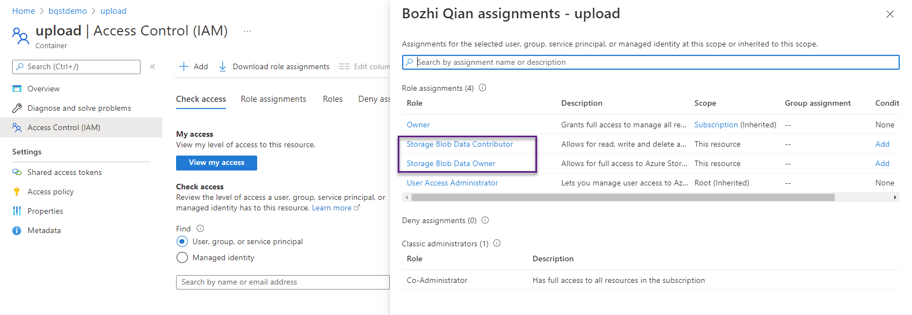
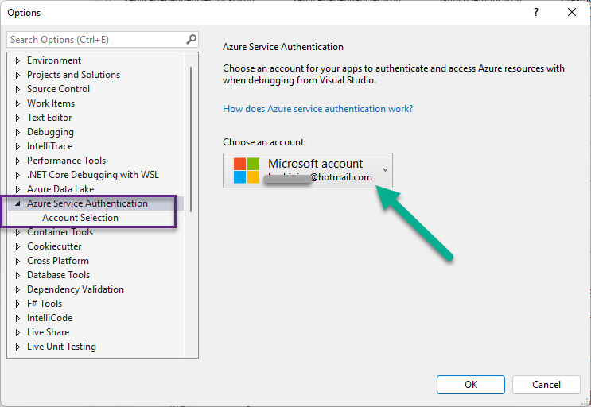

# Upload file to Azure Blob Container Demo

Upload file to Azure Blob Container from Azure Functions (**v4** on **.net 6**) By Azure **Managed Identity**.

Configurations:

1. Assigne your azure identity with "**Storage Blob Data Contributor**" and "**Storage Blob Data Owner**" in order to debug at VS2022. Once the azure function has been deployed to Azure, please grant its managed identity for these two role assignments instead.

   
2. Use your azure identity in VS2022 in order to run debug at your credential.

   

You can reach me at 
https://www.linkedin.com/in/bozhiqian/
